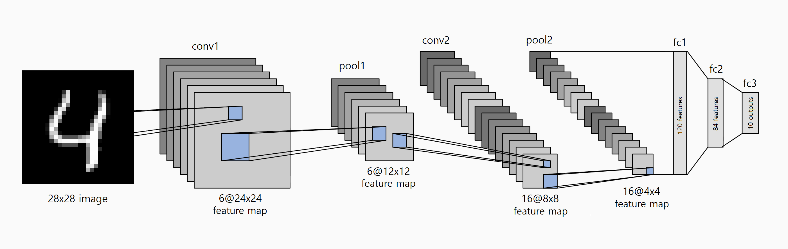

# cnn-fpga

## Project Overview

A LeNet-5 Convolutional Neural Network (CNN) hardware accelerator designed in synthesizable RTL Verilog/SystemVerilog and implemented on an A7-100T FPGA. The CNN is trained on the MNIST handwritten digit dataset and optimized for hardware inference, achieving ∼98.2% inference accuracy with uniform Q1.7 fixed-point quantization.

<p align="center">
  
</p>
<p align="center">
  
</p>

## Architecture Overview

The implementation follows the LeNet-5 architecture:

### Input Layer

- 28×28 grayscale image input (1 channel)
- Q1.7 fixed-point format (8-bit signed, 7 fractional bits)

### Convolutional Layers

- **Conv1**: 1×28×28 → 6×24×24 (6 filters, 5×5 kernel, stride 1, no padding)
- **Pool1**: 6×24×24 → 6×12×12 (2×2 max pooling, stride 2)
- **Conv2**: 6×12×12 → 16×8×8 (16 filters, 5×5 kernel, stride 1, no padding)
- **Pool2**: 16×8×8 → 16×4×4 (2×2 max pooling, stride 2)

### Fully Connected Layers

- **Flatten**: 16×4×4 = 256 neurons
- **FC1**: 256 → 120 neurons
- **FC2**: 120 → 84 neurons
- **FC3**: 84 → 10 neurons (digit classification)

## Project Structure

```
cnn-fpga/
├── rtl/
│   ├── cnn/                # CNN RTL modules
│   └── peripheral/         # Board top, display helper
├── constraints/            # Vivado constraints
├── sim/cnn/                # Simulation testbenches and test data
│   ├── golden_vectors/     # Expected layer outputs for verification
│   ├── test_images/        # Individual MNIST test images
│   └── test_images_bulk/   # Bulk test images for accuracy test
├── weights_mem/            # Quantized CNN weights and biases
└── python/                 # Model training, quantization, and test generation
```

## RTL Implementation

### CNN Components

- **cnn_top**: Top level state machine coordinating data flow through all layers (conv→relu→pool→flatten→fc), managing layer transitions and pipeline synchronization
- **conv_layer_1**: First convolutional layer implementing 6 parallel 5×5 filters, line buffering for 28×28 input, weight loading from BRAM, and ReLU activation
- **conv_layer_2**: Second convolutional layer implementing 16 parallel 5×5 filters, full-precision multi-channel accumulation across 6 input channels, weight loading from BRAM, and ReLU activation
- **conv_5x5**: Core 5×5 convolution MAC engine performing 25 serial multiply-accumulates, accumulation in 24-bit precision, bias addition, and Q1.7 scaling with saturation
- **relu**: ReLU activation function implementing max(0, x) for signed 8-bit Q1.7 values
- **pool_layer_1**: First pooling layer processing 6 channels of 24×24 feature maps with line buffering, producing 6×12×12 output
- **pool_layer_2**: Second pooling layer processing 16 channels of 8×8 feature maps with line buffering, producing 16×4×4 output
- **max_pool_2x2**: 2×2 max pooling unit with signed comparison
- **flatten**: Converts multi-dimensional feature maps (16×4×4) into a 256-element 1D vector for fully connected layers
- **fc_layer_1**: First fully connected layer performing matrix-vector multiplication (256→120) with 10 parallel neurons (12 batches), BRAM weight/bias reads, and ReLU activation
- **fc_layer_2**: Second fully connected layer performing matrix-vector multiplication (120→84) with 12 parallel neurons (7 batches), BRAM weight/bias reads, and ReLU activation
- **fc_layer_3**: Output layer performing matrix-vector multiplication (84→10) with a 10 parallel neurons (1 batch) for digit classification, BRAM weight/bias reads, no activation
- **weight_loader**: Centralized module routing weight and bias requests to BRAM memory modules based on layer selection

### Peripheral Components

- **fpga_top**: Board top level (Nexys A7-100T) with primary clock IBUF, reset/start synchronizers, wraps cnn_top with a demo ROM/FSM, switch decode, LED state encoding, and 7-segment drive
- **hex7seg**: Hex digit (0–F) to 7-segment segment lines (CA–CG)

### Weight Management

- Weights stored in BRAM via memory wrapper modules
- 8-bit signed fixed-point (Q1.7 format)
- Separate memory modules for weights and biases of each layer

## FPGA Implementation (`xc7a100tcsg324-1`)

### Resource Utilization (Vivado post-implementation)

| Resource | Utilization | Available | Utilization % |
| -------- | ----------- | --------- | ------------- |
| LUT      | 46339       | 63400     | 73.09         |
| LUTRAM   | 972         | 19000     | 5.12          |
| FF       | 61912       | 126800    | 48.83         |
| BRAM     | 125         | 135       | 92.59         |
| IO       | 32          | 210       | 15.24         |
| BUFG     | 2           | 32        | 6.25          |

### Timing (100 MHz clk)

| Metric            | Setup          | Hold           |
| ----------------- | -------------- | -------------- |
| Worst slack       | 0.049 ns (WNS) | 0.029 ns (WHS) |
| Total slack       | 0 ns (TNS)     | 0 ns (THS)     |
| Failing endpoints | 0              | 0              |
| Total endpoints   | 182440         | 182440         |

### Power

| Metric               | Value            |
| -------------------- | ---------------- |
| Total on-chip power  | 1.022 W          |
| Junction temperature | 29.7 °C          |
| Thermal margin       | 55.3 °C (12.0 W) |
| Effective θJA        | 4.6 °C/W         |

## FPGA demo (Nexys A7-100T, `xc7a100tcsg324-1`)

`rtl/peripheral/fpga_top.sv` is the board top. It embeds ten MNIST images in ROM, streams the chosen image into `cnn_top`, and shows status on LEDs and the predicted class on the 7-segment display after inference.

### Flow

1. **`IDLE`**: Select a stored test image with the switches, then press `start`
2. **`LOAD`**: Streams 28×28 pixels from on-chip ROM into the CNN
3. **`INFERENCE`**: Runs CNN forward pass
4. **`DONE`**: Predicted digit appears on the hex display

**Board I/O** (see `constraints/constraints.xdc`)

| Signal     | Nexys A7  | Role                                                                       |
| ---------- | --------- | -------------------------------------------------------------------------- |
| `sw[9:0]`  | SW0-SW9   | One-hot: digit select: `sw[i]` chooses the ROM image (0-9)                 |
| `start`    | BTND      | In `IDLE`, starts run                                                      |
| `rst`      | BTNC      | Reset                                                                      |
| `led[3:0]` | LED0-LED3 | FSM state: `IDLE` = LED0, `LOAD` = LED1, `INFERENCE` = LED2, `DONE` = LED3 |
| `seg7`     | 7-segment | Display predicted digit (0–9) after `DONE`                                 |

## Simulation

### Full CNN pipeline test

```bash
iverilog -g2012 -o sim/cnn/tb_cnn_top.vvp sim/cnn/tb_cnn_top.sv rtl/cnn/*.v rtl/cnn/*.sv && vvp sim/cnn/tb_cnn_top.vvp
```
- Runs the complete LeNet-5 pipeline on an MNIST test image and outputs the predicted digit class

### Note:

- To test a different image, edit line 127 in `tb_cnn_top.sv` to change the input image path:
  ```systemverilog
  $readmemh("sim/cnn/test_images/test_image_X.mem", test_image);  // Test digit X (0-9)
  ```
- Golden vector comparison is disabled by default (`ENABLE_GOLDEN_COMPARE = 0`), only enable when testing digit 4 with corresponding golden vectors

### Individual module tests

```bash
# conv_5x5
iverilog -g2012 -o sim/cnn/tb_conv_5x5.vvp sim/cnn/tb_conv_5x5.v rtl/cnn/conv_5x5.v && vvp sim/cnn/tb_conv_5x5.vvp

# conv_layer_1
iverilog -g2012 -o sim/cnn/tb_conv_layer_1.vvp sim/cnn/tb_conv_layer_1.v rtl/cnn/*.v rtl/cnn/*.sv && vvp sim/cnn/tb_conv_layer_1.vvp

# conv_layer_2
iverilog -g2012 -o sim/cnn/tb_conv_layer_2.vvp sim/cnn/tb_conv_layer_2.sv rtl/cnn/*.v rtl/cnn/*.sv && vvp sim/cnn/tb_conv_layer_2.vvp

# pool_layer_1
iverilog -g2012 -o sim/cnn/tb_pool_layer_1.vvp sim/cnn/tb_pool_layer_1.sv rtl/cnn/pool_layer_1.v rtl/cnn/max_pool_2x2.v && vvp sim/cnn/tb_pool_layer_1.vvp

# pool_layer_2
iverilog -g2012 -o sim/cnn/tb_pool_layer_2.vvp sim/cnn/tb_pool_layer_2.sv rtl/cnn/pool_layer_2.v rtl/cnn/max_pool_2x2.v && vvp sim/cnn/tb_pool_layer_2.vvp

# relu
iverilog -g2012 -o sim/cnn/tb_relu.vvp sim/cnn/tb_relu.v rtl/cnn/relu.v && vvp sim/cnn/tb_relu.vvp

# flatten
iverilog -g2012 -o sim/cnn/tb_flatten.vvp sim/cnn/tb_flatten.sv rtl/cnn/flatten.v && vvp sim/cnn/tb_flatten.vvp

# fc_layer_1
iverilog -g2012 -o sim/cnn/tb_fc_layer_1.vvp sim/cnn/tb_fc_layer_1.v rtl/cnn/*.v rtl/cnn/*.sv && vvp sim/cnn/tb_fc_layer_1.vvp

# fc_layer_2
iverilog -g2012 -o sim/cnn/tb_fc_layer_2.vvp sim/cnn/tb_fc_layer_2.v rtl/cnn/*.v rtl/cnn/*.sv && vvp sim/cnn/tb_fc_layer_2.vvp

# fc_layer_3
iverilog -g2012 -o sim/cnn/tb_fc_layer_3.vvp sim/cnn/tb_fc_layer_3.v rtl/cnn/*.v rtl/cnn/*.sv && vvp sim/cnn/tb_fc_layer_3.vvp

# fc_layers
iverilog -g2012 -o sim/cnn/tb_fc_layers.vvp sim/cnn/tb_fc_layers.v rtl/cnn/*.v rtl/cnn/*.sv && vvp sim/cnn/tb_fc_layers.vvp
```

### Accuracy test

```bash
iverilog -g2012 -o sim/cnn/tb_cnn_top_bulk.vvp sim/cnn/tb_cnn_top_bulk.sv rtl/cnn/*.v rtl/cnn/*.sv && vvp sim/cnn/tb_cnn_top_bulk.vvp
```
- Tests the CNN on 1000 MNIST test set images (100 per digit) and measures correctness
- Accuracy is limited by the trained model quality and the quantization error introduced by Q1.7 weights/activations + the `FC_SCALE_FACTOR` used to keep FC accumulators from saturating

```bash
=== Accuracy Results ===

Digit 0: 99/100 correct (99%)
Digit 1: 98/100 correct (98%)
Digit 2: 100/100 correct (100%)
Digit 3: 99/100 correct (99%)
Digit 4: 97/100 correct (97%)
Digit 5: 97/100 correct (97%)
Digit 6: 97/100 correct (97%)
Digit 7: 97/100 correct (97%)
Digit 8: 99/100 correct (99%)
Digit 9: 99/100 correct (99%)

Total Accuracy: 982/1000 correct (98.20%)
```

## Generating Test Images

Test images can be generated from the MNIST dataset using the `generate_test_image.py` or `generate_bulk_test_images.py` script:

```bash
# Generate test image for a specific digit (0-9)
python python/generate_test_image.py --digit 7

# Generate test image for a random digit
python python/generate_test_image.py --random

# Generate a specific occurrence of a digit
python python/generate_test_image.py --digit 4 --index 5

# Generate bulk test images
python python/generate_bulk_test_images.py
```

Single test images are saved to `sim/cnn/test_images/` in both `.txt` (raw pixel values) and `.mem` (Q1.7 quantized hex) formats.
Accuracy test images are saved to `sim/cnn/test_images_bulk/` in `.mem` format.

## Yosys Generic Synthesis

```bash
yosys synth.ys
```

Output: synth_cnn_top.v