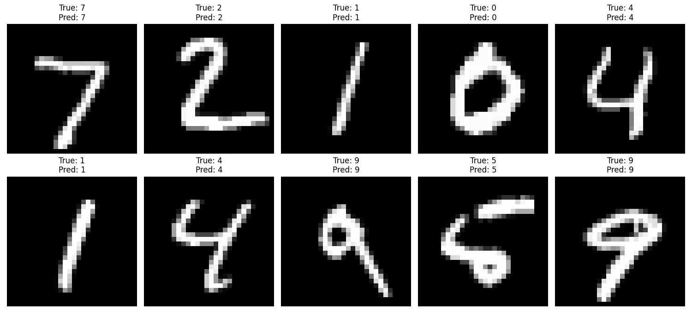

# cnn-fpga
## Project Overview
This project implements a LeNet-5 Convolutional Neural Network (CNN) in RTL Verilog/SystemVerilog for real-time handwritten digit recognition. The CNN is trained on the MNIST dataset and optimized for FPGA deployment using uniform Q1.7 fixed-point quantization.



## Architecture Overview

The implementation follows the LeNet-5 architecture:

### Input Layer
- 28×28 grayscale image input (1 channel)
- Q1.7 fixed-point format (8-bit signed, 7 fractional bits)

### Convolutional Layers
- **Conv1**: 1×28×28 → 6×24×24 (6 filters, 5×5 kernel, stride 1, no padding)
- **Pool1**: 6×24×24 → 6×12×12 (2×2 max pooling, stride 2)
- **Conv2**: 6×12×12 → 16×8×8 (16 filters, 5×5 kernel, stride 1, no padding)
- **Pool2**: 16×8×8 → 16×4×4 (2×2 max pooling, stride 2)

### Fully Connected Layers
- **Flatten**: 16×4×4 = 256 neurons
- **FC1**: 256 → 120 neurons
- **FC2**: 120 → 84 neurons
- **FC3**: 84 → 10 neurons (digit classification)


## Project Structure
```
cnn-fpga/
├── rtl/cnn/          # CNN RTL modules (Verilog/SystemVerilog)
├── sim/cnn/          # Component testbenches and golden vectors
├── weights_mem/      # Quantized CNN weights (.mem format)
├── golden_vectors/   # Expected layer outputs for verification
└── python/           # Model training, quantization, and test generation
```


## RTL Implementation

### CNN Components
- **cnn_top**: Top level state machine coordinating data flow through all layers (conv→relu→pool→flatten→fc), managing layer transitions and pipeline synchronization
- **conv_5x5**: Core 5×5 convolution kernel performing element-wise multiplication, accumulation in 24-bit precision, bias addition, and Q1.7 scaling with saturation
- **conv_layer_1**: First convolutional layer implementing 6 parallel 5×5 filters, line buffering for 28×28 input, weight loading from BRAM, and ReLU activation
- **conv_layer_2**: Second convolutional layer implementing 16 parallel 5×5 filters, full-precision multi-channel accumulation across 6 input channels, weight loading from BRAM, and ReLU activation
- **max_pool_2x2**: 2×2 max pooling unit with signed comparison
- **pool_layer_1**: First pooling layer processing 6 channels of 24×24 feature maps with line buffering, producing 6×12×12 output
- **pool_layer_2**: Second pooling layer processing 16 channels of 8×8 feature maps with line buffering, producing 16×4×4 output
- **flatten**: Converts multi-dimensional feature maps (16×4×4) into a 256-element 1D vector for fully connected layers
- **fc_layer_1**: First fully connected layer performing matrix-vector multiplication (256→120), weight/bias access from BRAM with proper latency handling, and ReLU activation
- **fc_layer_2**: Second fully connected layer performing matrix-vector multiplication (120→84), weight/bias access from BRAM with proper latency handling, and ReLU activation
- **fc_layer_3**: Output layer performing matrix-vector multiplication (84→10) for digit classification, weight/bias access from BRAM with proper latency handling, no activation
- **relu**: ReLU activation function implementing max(0, x) for signed 8-bit Q1.7 values
- **weight_loader**: Centralized module routing weight and bias requests to BRAM memory modules based on layer selection


### Weight Management
- Weights stored in BRAM via memory wrapper modules
- 8-bit signed fixed-point (Q1.7 format)
- Separate memory modules for weights and biases of each layer


## Simulation

### Full CNN pipeline test
```bash
iverilog -g2012 -o sim/cnn/tb_cnn_top.vvp sim/cnn/tb_cnn_top.sv rtl/cnn/*.v rtl/cnn/*.sv && vvp sim/cnn/tb_cnn_top.vvp
```
- Runs the complete LeNet-5 pipeline on an MNIST test image and outputs the predicted digit class

### Note: 
- To test a different image, edit line 127 in `tb_cnn_top.sv` to change the input image path:
  ```systemverilog
  $readmemh("sim/cnn/test_images/test_image_X.mem", test_image);  // Test digit X (0-9)
  ```
- Golden vector comparison is disabled by default (`ENABLE_GOLDEN_COMPARE = 0`). Enable it only when testing digit 4 with the corresponding golden vectors.

### Individual module tests
```bash
# conv_5x5
iverilog -g2012 -o sim/cnn/tb_conv_5x5.vvp sim/cnn/tb_conv_5x5.v rtl/cnn/conv_5x5.v && vvp sim/cnn/tb_conv_5x5.vvp

# conv_layer_1
iverilog -g2012 -o sim/cnn/tb_conv_layer_1.vvp sim/cnn/tb_conv_layer_1.v rtl/cnn/*.v rtl/cnn/*.sv && vvp sim/cnn/tb_conv_layer_1.vvp

# conv_layer_2
iverilog -g2012 -o sim/cnn/tb_conv_layer_2.vvp sim/cnn/tb_conv_layer_2.sv rtl/cnn/*.v rtl/cnn/*.sv && vvp sim/cnn/tb_conv_layer_2.vvp

# pool_layer_1
iverilog -g2012 -o sim/cnn/tb_pool_layer_1.vvp sim/cnn/tb_pool_layer_1.sv rtl/cnn/pool_layer_1.v rtl/cnn/max_pool_2x2.v && vvp sim/cnn/tb_pool_layer_1.vvp

# pool_layer_2
iverilog -g2012 -o sim/cnn/tb_pool_layer_2.vvp sim/cnn/tb_pool_layer_2.sv rtl/cnn/pool_layer_2.v rtl/cnn/max_pool_2x2.v && vvp sim/cnn/tb_pool_layer_2.vvp

# relu
iverilog -g2012 -o sim/cnn/tb_relu.vvp sim/cnn/tb_relu.v rtl/cnn/relu.v && vvp sim/cnn/tb_relu.vvp

# flatten
iverilog -g2012 -o sim/cnn/tb_flatten.vvp sim/cnn/tb_flatten.sv rtl/cnn/flatten.v && vvp sim/cnn/tb_flatten.vvp

# fc_layer_1
iverilog -g2012 -o sim/cnn/tb_fc_layer_1.vvp sim/cnn/tb_fc_layer_1.v rtl/cnn/*.v rtl/cnn/*.sv && vvp sim/cnn/tb_fc_layer_1.vvp

# fc_layer_2
iverilog -g2012 -o sim/cnn/tb_fc_layer_2.vvp sim/cnn/tb_fc_layer_2.v rtl/cnn/*.v rtl/cnn/*.sv && vvp sim/cnn/tb_fc_layer_2.vvp

# fc_layer_3
iverilog -g2012 -o sim/cnn/tb_fc_layer_3.vvp sim/cnn/tb_fc_layer_3.v rtl/cnn/*.v rtl/cnn/*.sv && vvp sim/cnn/tb_fc_layer_3.vvp

# fc_layers
iverilog -g2012 -o sim/cnn/tb_fc_layers.vvp sim/cnn/tb_fc_layers.v rtl/cnn/*.v rtl/cnn/*.sv && vvp sim/cnn/tb_fc_layers.vvp
```


## Generating Test Images

Test images can be generated from the MNIST dataset using the `generate_test_image.py` script:

```bash
# Generate test image for a specific digit (0-9)
python python/generate_test_image.py --digit 7

# Generate test image for a random digit
python python/generate_test_image.py --random

# Generate a specific occurrence of a digit
python python/generate_test_image.py --digit 4 --index 5
```

Test images are saved to `sim/cnn/test_images/` in both `.txt` (raw pixel values) and `.mem` (Q1.7 quantized hex) formats.


## Next Steps
- Create another testbench that tests the full hardware CNN pipeline through a high volume of unique MNIST digits (0-9) to study inference accuracy
